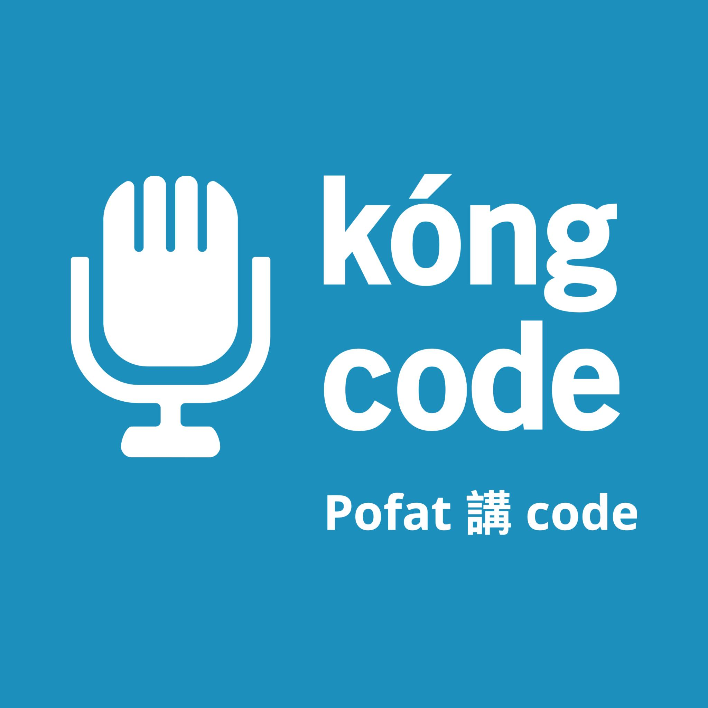
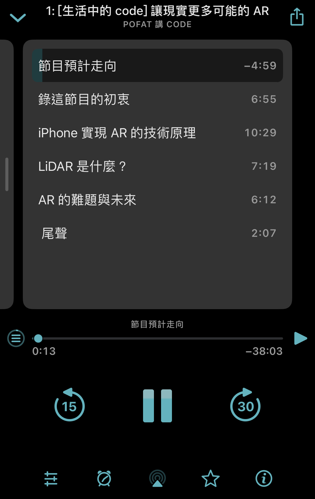

# Pofat 講 code podcast

以母語探索資訊科技的世界，Pofat 講 code ( Pofat kóng code）是一個以台語為主，夾雜部分英語的 podcast，內容專注在兩大方向：聊生活裡的科技原理與探討軟體工程裡的技術層面，節目也因此分成兩個系列。

* **「生活中的 code」**：探討生活中可見的科技其原理與實現方式，主要會以手機或與其相關的硬體做為探討對象，尤其是 iPhone。
* **「軟體工程變啥魍」**：則會比較深入地探討軟體工程的技術，內容主要會以 Apple 相關的技術為主題出發。

對台語、科技與軟體技術有喜好的朋友歡迎一起來交流討論，或將問題丟過來[發起挑戰賽](https://twitter.com/pofat_kongcode/status/1339604357763887104)讓主持人回答！！

[Pofat 講 code 歷史](/history)

## 線上收聽

可使用 <a href="https://overcast.fm/itunes1545383775/pofat-code">Overcast</a>、<a href="https://www.listennotes.com/podcasts/pofat-講-code-pofat-A8cJHhVfxlg/">Listen Notes</a>、<a href="https://podcast.kkbox.com/channel/LarV8K8O4jH_rwFbTk">KKBOX</a>。

## 訂閱方式

**Pofat 講 code** 支援任何 podcast 播放軟體，只要訂閱我們的 [RSS](feed:https://api.soundon.fm/v2/podcasts/832a4f37-a4c4-410f-883e-e73113ee0527/feed.xml) 網址即可。

    

## 節目列表

### 第一季

[4: [軟體工程變啥魍] 新的一年一起學台語](/episodes/4)

[3: [生活中的 code] 一掃即應的 QR Code](/episodes/3)

[2: [軟體工程變啥魍] 柏拉圖式的程式思維](/episodes/2)

[1: [生活中的 code] 讓現實更多可能的 AR](/episodes/1)

## 主持人

**波肥** / Pofat
[@PofatTseng](https://twitter.com/@PofatTseng)

## 常見問題
Q: 這個 podcast 是關於什麼？  
A: 一位開發 iOS app 一段時間的台灣軟體工程師，試圖以他的母語和大家聊聊各種 Apple 相關的科技與技術，也會有特別來賓訪談。

Q: 你們的更新時間與頻率？  
A: 不定期會更新，最短是一週一次。

Q: 為什麼叫作 **Pofat 講 code**？  
A: 想用母語來聊天，就是台語。想聊我的專業和感興趣的事物，就是 code。

Q: 什麼是收聽 **Pofat 講 code** 最棒的方式？
A: 你可以使用任何 podcast app，個人推薦 [Overcast](https://apps.apple.com/us/app/overcast/id888422857) 這個 iOS app，有體驗最好的筆記與章節功能。最重要的是，**請 follow 我們的 [Twitter](https://twitter.com/pofat_kongcode)**，才不會錯過任何最新消息😘

Q: 我想要聽 OO 題目 / 我想要回饋或提供意見...  
A: 基本上使用 Twitter 有三種方式，請到我們的 [Twitter](https://twitter.com/pofat_kongcode) 回覆與 DM、發起[挑戰賽](https://twitter.com/pofat_kongcode/status/1339604357763887104)，或在[提問箱](https://peing.net/zh-TW/pofat_kongcode)匿名發問；當然你也可以寫 [email](mailto:pofat.kongcode@gmail.com) 給我們。

## 筆記與章節功能

**Pofat 講 code** 每一集都會包含節目內容的筆記與章節，方便你查看相關連結，以及跳轉到特定位置。下圖以 Overcast 為例：

### 筆記（Show Note）

### 章節（Chapter Marker）

## 後台系統
我們使用 [SoundOn](https://host.soundon.fm) 上架。

## 特別感謝

音訊工程師 - 緃谷盧蜜亞
